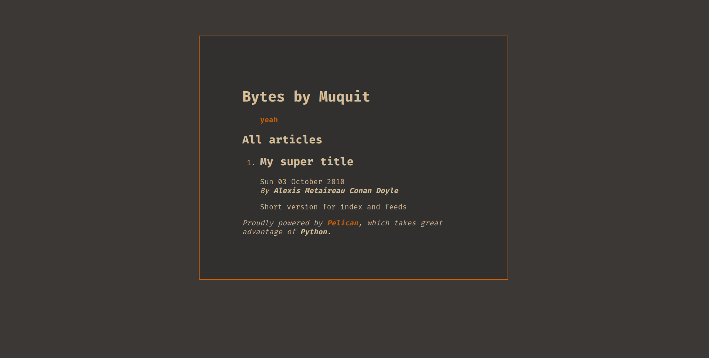

### Pelican Phoenix Theme

  _/|       |\_  
 /  |       |  \ 
|    \     /    |
|  \ /     \ /  |
| \  |     |  / |
| \ _\_/^\_/_ / |
|    --\//--    |
 \_  \     /  _/ 
   \__  |  __/   
      \ _ /      
     _/   \_     
    / _/|\_ \    
     /  |  \     
      / v \      

This theme based on slightly modified gruvbox color scheme
It supports Google Analytics and has a Jappix widget.

#### Installation
Create a directory `themes` inside the root level of your project. Clone the Pelican Phoenix theme inside the `themes` directory that you created.


```bash
$ mkdir themes
$ git clone https://github.com/AmamDewan/pelican-phoenix-theme.git themes/pelican-phoenix-theme
```
Add or update `THEME` variable in your `pelicanconf.py`
```python
THEME = 'themes/pelican-phoenix-theme'
```

#### Gratitude

This project is based on landing page [muquit.xyz](https://github.com/AmamDewan/muquit.xyz) which is a fork of [sadman.xyz](https://gitlab.com/KaziSadmanAhmed/sadman.xyz).


[Pelican]: https://getpelican.com
[Tailwind CSS]: https://tailwindcss.com
[DausyUI]: https://daisyui.com
